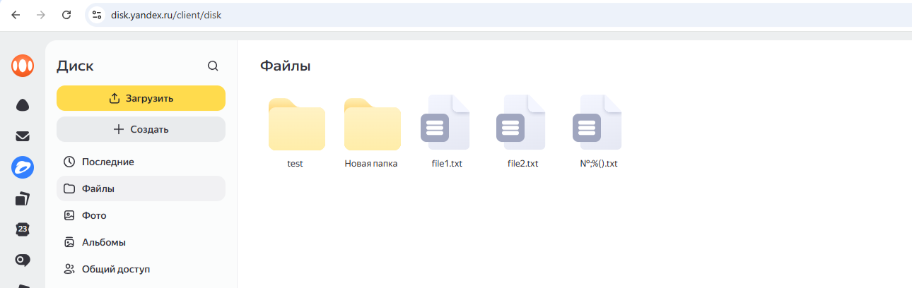
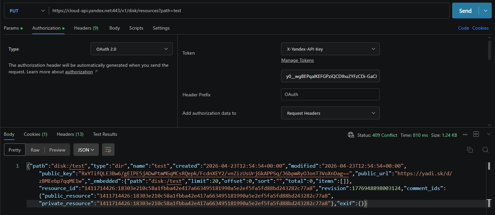

Bug-Report-001. Создание существующей папки

Тип: Bug;
Серьёзность: Trivial;
Приоритет: Low;
Предусловия:
- Сформирован валидный OAuth токен;
- На диске существует папка "test"
    - Скриншот содержимых файлов на диске:
    
Шаги:
1. Отправить PUT запрос: https://cloud-api.yandex.net/v1/disk/resources?path=test;
Ожидаемый результат:
- Получен http-код: 401.
Фактический результат:
- Получен http-код: 409 (Conflict).
Скриншот фактического результата:
