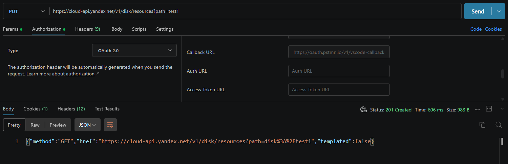

Bug-Report-002. Создание новой папки

Тип: Bug;
Серьёзность: Trivial;
Приоритет: Low;
Предусловия:
- Сформирован валидный OAuth токен;
- На диске не существует папки "test1";
Шаги:
1. Отправить PUT запрос: https://cloud-api.yandex.net/v1/disk/resources?path=test1;
Ожидаемый результат:
- Получен http-код: 200;
- Получено тело ответа json формата {"method":"string","href":"string","templated":true};
- Папка была создана на диске.
Фактический результат:
- Получен http-код: 201 (Created);
- Получено тело ответа json формата {"method":"string","href":"string","templated":false};
- Папка была создана на диске.
Скриншот фактического результата:
