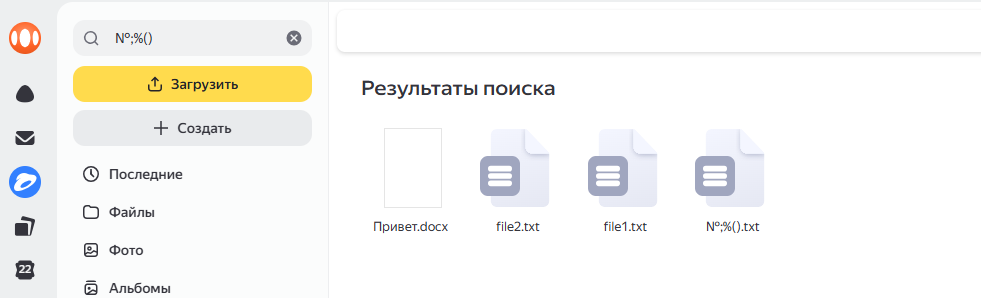

Bug-Report-001. Поиск существующего файла с названием из спецсимволов

Тип: Bug;
Серьёзность: Trivial;
Приоритет: Low;
Предусловия:
- На Яндекс.Диск загружено несколько файлов
    Скриншот содержимых файлов на диске:
    
- Название одного из файлов "№;%()";
Шаги:
1. Открыть Яндекс.Диск;
2. Ввести в поиск "№;%()";
Ожидаемый результат:
- Отображается файл с названием "№;%()";
Фактический результат:
- Отображается файл с названием "№;%()" и файлы, не входящий в искомое слово;
Скриншот фактического результата:
